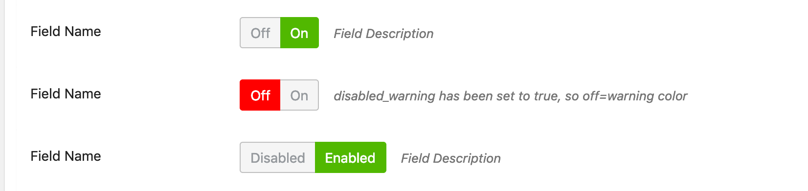

# CMB2 Switch Button Field Type


##  Usage:

`switch` as a field type.

```php
 			array(
			'name' => __( 'Field Name', 'cmb2' ),
			'desc'    => __( 'Field Description', 'cmb2' ),
			'id'      => 'your_switch_button',
			'type'    => 'switch',
			'default'    => 0,
			'disabled_warning' => true, // switch between gray and red button style for disabled.
			'label'    => array('on'=> 'On', 'off'=> 'Off')
		),
```


## Screenshot



